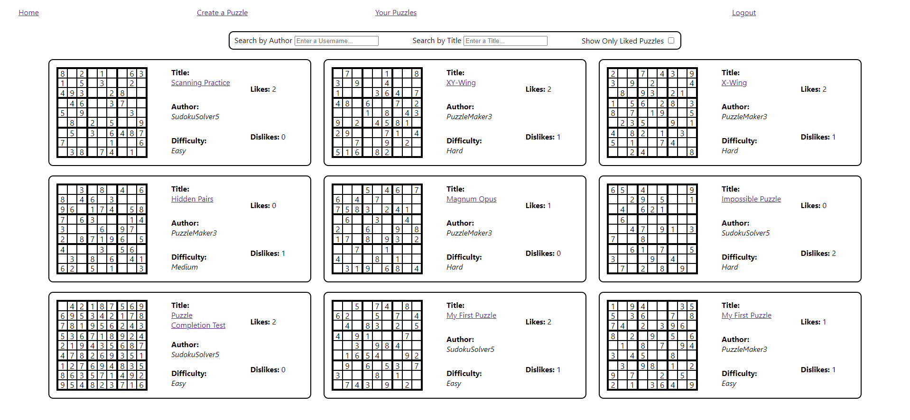

# Sudoku Source


## Purpose

The purpose of this app is to provide a platform for Sudoku enthusiasts to create and share puzzles with other Sudoku enthusiasts.

## Features

- An easy to use Sudoku puzzle creation UI (including a puzzle template generator)
- A puzzle feed with multiple search tools that lets users filter the feed to their specifications
- A like/dislike system to inform users of the quality of each puzzles
- A built-in play feature that allows users to play other users puzzles

## How to Run 
1. Clone the repository with: ```git clone git@github.com:evanm4183/sudoku-source.git```
2. Step into the root directory with: ```cd sudoku-source```
3. Once here, run ```npm install``` then ```npm start``` to start the client
4. In a new terminal, use ```cd sudoku-source/database``` to access the directory with sample data
5. Once here, use ```json-server database.json -p 8088 -w``` to lauch the API
6. View the website with the login ```demo@email.com``` (should populate with this by default)

## Tech Stack


## Views

### Home Page

